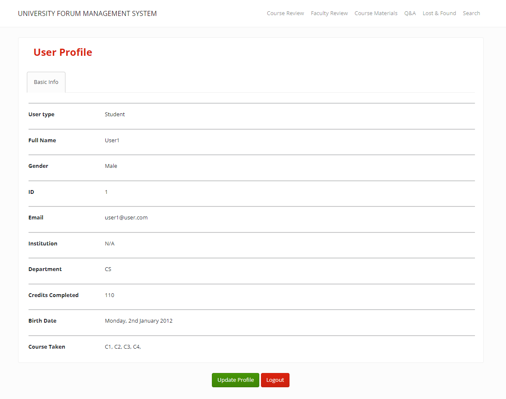

# University Forum Management System

Welcome to the University Forum Management System, a platform designed to support and facilitate university students. This system offers a range of features to enhance the student experience:

## Features:

### Personal Profile Registration
- Current students can create personal profiles to access the system.

### Admin Profiles
- Administrators of the University Forum Management System have dedicated profiles.

### User Validation
- Registration constraints are in place to ensure user validity and security.

### Discussion and Q&A
- All registered users can engage in discussions, ask questions, and provide answers.

### Lost and Found
- Students can report lost items found on campus.

### Search Functionality
- Users can search for course and faculty reviews.

### Reports
- Users have access to a 'Reports' section based on the information collected.

## Goals:

Our primary objectives for this project are as follows:

1. Create a unique platform that fosters discussions and interactions among students and alumni.

2. Provide assistance to new students, helping them become comfortable with the university and courses.

3. Offer a convenient way for individuals to retrieve lost items on campus.

We hope this system enhances the university experience and fosters a sense of community among its members.

## Some Demo images:

 

### This project is prepared by:
[Golam Dastagir](https://github.com/golamdastagir/)

[Faiyaz Al-Mamoon](https://github.com/FaiyazMamoon/)

[Mohammad Nazmus Saquib](https://github.com/Arduino480/)
